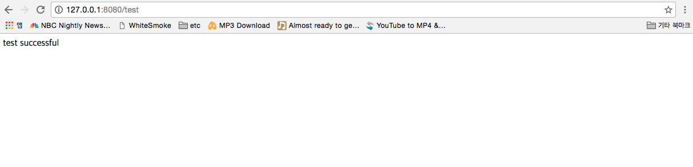
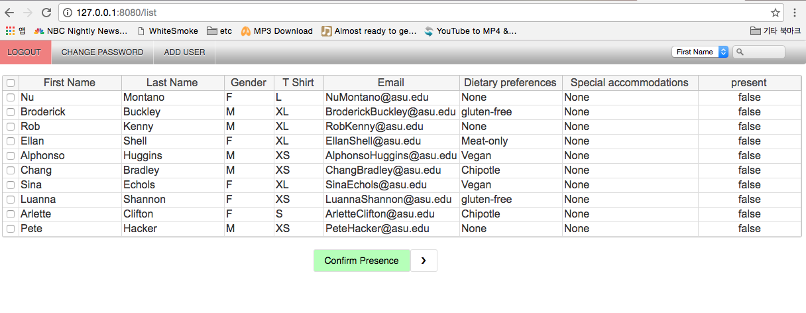
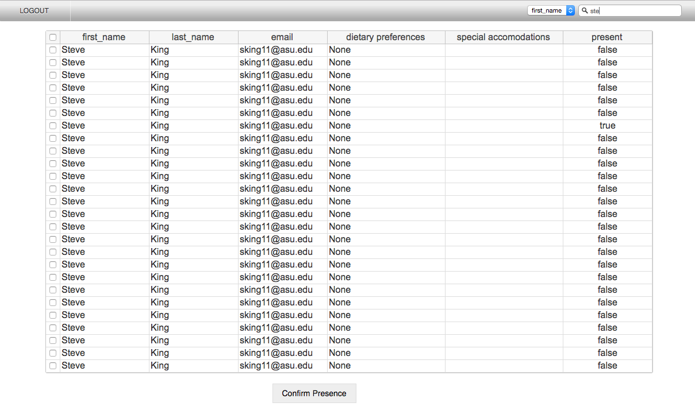
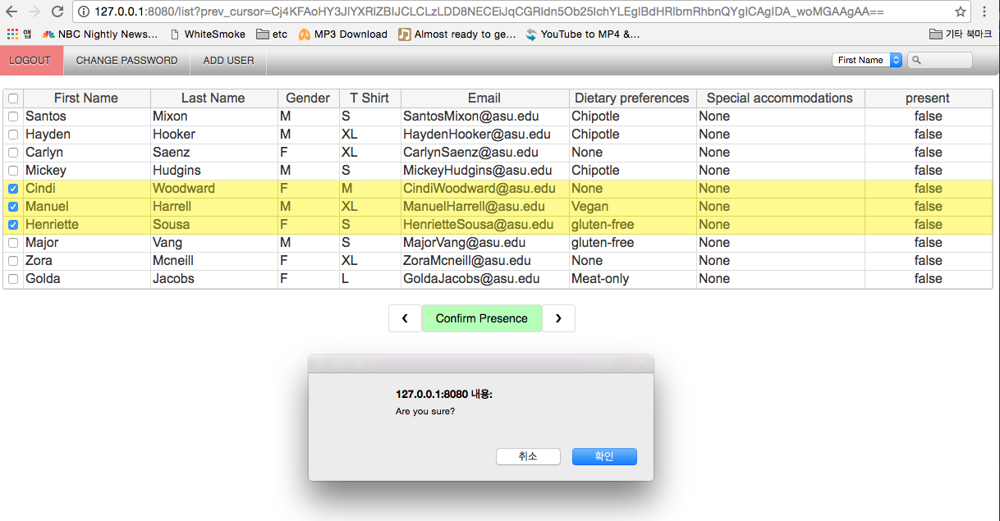

## swhacks check-in project

- django oriented framework
- author : sunghohong

| directory  |  context   |
| ------------- |-------------|
| modals | modal of django object |
| templates | front-end source files |
| views | controllers |

## User UI description

> ### Adding test data

must add the test data by using the link localhost:8080/test

> ### Login

the login information can be found in models/User.py

> ### Paging

paging is possible by clicking the arrow button at the bottom

> ### Search

Search the data by using the top right search text

> ### Update presence

Update the attendees by clicking them and press the confirm Presence button
The 'Present' Column will change based on it's content.
ex) True -> False,  False -> True

 
 

## Distribution of Workload

| Developer | Description |
| ------------- |-------------|
| Ryan | Data Integration and LoginHandler |
| SungHo | CheckinListHandler |
| Dj |  CheckinUpdateHandler |

