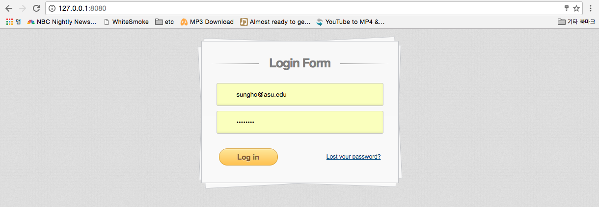
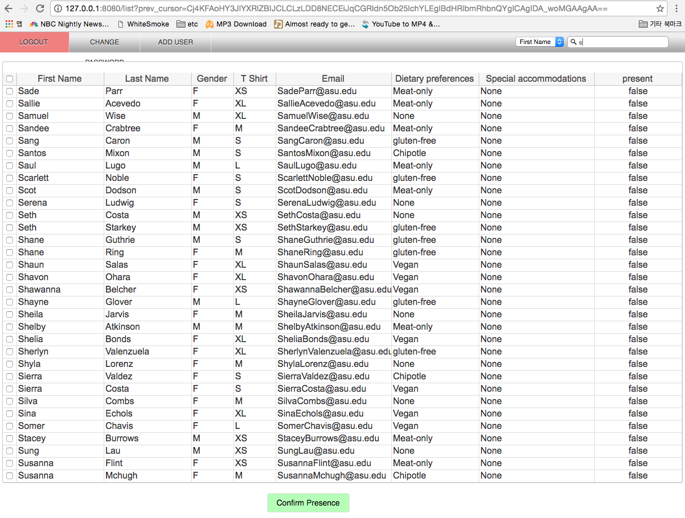
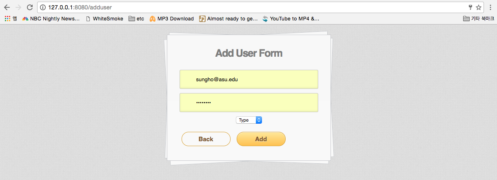

## swhacks check-in project

- django oriented framework
- author : sunghohong

| directory  |  context   |
| ------------- |-------------|
| modals | modal of django object |
| templates | front-end source files |
| views | controllers |

## User UI description

> ### <0> Adding test data

- must add the test data by using the link localhost:8080/test
- the existing test data in your localhost will be removed and added with the new data.
- the source of the test data can be found in [modals/Attendant.py](modals/Attendant.py)
- the source of the reference data used in the test data can be found in [modals/testFiles](modals/testFiles)

> ### <1> Login

- the login information can be found in [modals/User.py](modals/User.py)

> ### <2> Paging

- paging is possible by clicking the arrow button at the bottom
- the each arrow button will disappear at the first and the last of the row.

> ### <3> Changing the Password

- clicking on the change password button on the top left will redirect to password change page

> ### <4> Search

- Search the data by typing in the input on the top right and press enter
- While searching the paging is not possible for the current state.
- Searching with empty words will disable the search mode and reactivate the paging.

> ### <5> Update presence

- Update the attendees by clicking them and press the confirm Presence button
- The 'Present' Column will change based on it's content.
- ex) True -> False,  False -> True

> ### <6> Adding users

- If the user's type property is Administer, he or she will be able to add more users by clicking on the Add user button on the top left.
- the user type can be found in the [modals/User.py](modals/User.py)

 
 

## Distribution of Workload

| Developer | Description |
| ------------- |-------------|
| Ryan | Data Integration and LoginHandler |
| SungHo | CheckinListHandler |
| Dj |  CheckinUpdateHandler |

